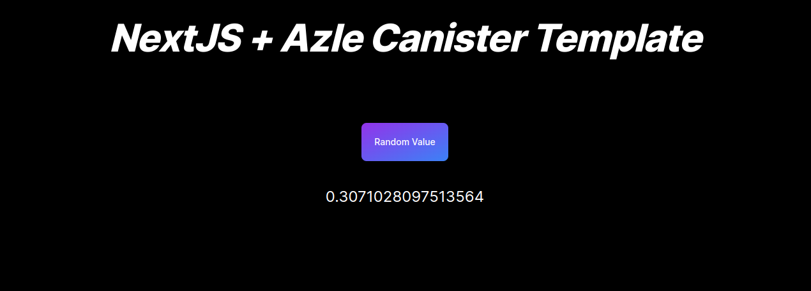

# IC Dapp Template

## Prerequisites

- dfx > 0.14.0
- Nodejs >= 18.16.0
- yarn

Follwing are the steps to deploy your application locally

1. Install dependencies:

   - `yarn && cd/azle && yarn && cd..`

2. Run below command: -`dfx start --clean --background`

   - `bash scripts/deploy_frontend_canister.sh  local`

3. Stop canister:
   -`dfx stop`

   
